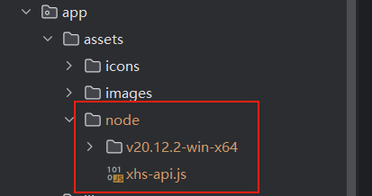

## 一片红薯地 - 开源修复版

该项目是基于 `PySide6` 和 `y-xhs` 所开发的某红薯自动化评论工具，曾经也是一款好产品，但是现在风控程度如何原作者也不知，使用本软件导致您产生的任何损失请自行负责。支持：多账号并发采集、点赞、评论、收藏笔记，可检查评论是否屏蔽，支持艾特用户，红薯号管理、持久配置管理...

### 项目声明

> 该项目秉持开源精神，除了核心代码段有所保留，其他界面、逻辑等代码进行了开仓，代码仅供学习参考，请勿非法大量进行采集，如有侵犯贵司或贵组织的权益，请尽快联系我删除

1. 使用本项目获取某红薯官网数据的风险由使用者自行承担。
2. 本项目的首任开发者（顾平安）不对使用者的行为和后果负责。
3. 在使用本项目时，请谨慎评估风险，并自行决定是否合适使用。

> 一旦安装、使用、二次开发本项目，则表示您已经知晓并同意以上声明

### 部署和运行

环境依赖管理基于 `poetry`，因此请务必先安装 `poetry`：

```bash
pip install poetry  # 你可以使用 -i 镜像源地址 加速下载
```

接下来请安装依赖：

```bash
# 为了限制应用泛滥而导致官方接口变动，打赏后请自行留下邮箱，我将发送本地依赖 y-xhs 包以及缺乏的 node 文件夹
# y-xhs 的包文件放于 项目根目录/pack/packages 该路径下，如果路径不存在，请手动创建即可
poetry lock
poetry install
```

> 关于 `y-xhs` 包，已经不再免费共享，具体请查看：[关于 Donate](https://github.com/gupingan/khs-pyside6/issues/24)

项目中，默认不上传 `node` 文件夹的。在您打赏后，请您在 issues 中特别告知你需要的不仅仅是 y-xhs，还有 node 目录以及打包配置。该目录在您接收到后，请按一下路径复制：



开发情景下：

- Pycharm 中设置好 poetry 环境后，可直接运行 `main.py` 入口文件
- 终端环境中运行，键入命令：`poetry run python main.py`

应用默认是单例运行，如需修改请自行查看 `app` 包的 `__init__.py` 文件。

如果你需要打包成 `exe` 可执行文件，请务必参考下方提示。

首先，项目推荐至少 Win10 运行（Wind 7/8未测试），已经支持将`nodejs`环境也打包进入程序中，
如果需要打包文件 `main.spec`，请在打赏后务必告知一下。

将 `main.spec` 文件置于项目根目录，运行命令：

```
pyinstaller ./main.spec  # 注意生成的 dist 目录即可
```

### 使用文档

使用文档请参考：[使用文档](docs/DOC.md)，写得非常粗糙，随便写的哈~