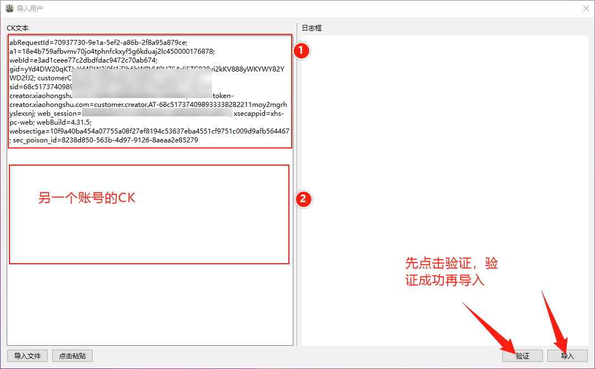

# 操作手册

## 一、基础界面


**菜单栏**：包含创建配置、添加账号、添加艾特账号、创建运行单元等诸多功能。

**多单元操作区域**：包含运行中、暂停中、已停止的单元，稍后会说明单元是什么。

**状态数据栏**：左侧有一些加载文字的描述，通常不用理会，右侧包含当前单元所指向的数据，分别是：

- 采集的笔记条数
- 不评论的笔记有多少条（比如跳过已收藏的笔记，就是不评论的，亦或者没有勾选评论功能）
- 评论成功的笔记有多少条（指评论正常，未勾选检查评论屏蔽的情况下，默认成功）
- 评论失败的笔记条数（勾选检查屏蔽时，由于账号原因，评论过多导致屏蔽，他人无法看到您的评论的情况，将会记录，另外就是其他出乎意料的评论失败情况，非常罕见）

## 二、必需配置

### 2.1 软件协议

进入软件时，会提示签署协议，请填写名字后进行签署，同意并使用。


### 2.2 设置环境 CK

接下来会弹出初次的设置，设置后，后续都不会再弹，必须设置：


点击打开浏览器，可以不用登录小红书，然后请参见：[CK 的提取教程](#4.2.2 CK 的提取教程)。

### 2.3 设置联动账号

提取任意账号（必须登录后提取）的 web_session 值，就是 CK 中 web_session= 到分号`;` 的值。

点击菜单栏中`设置`，设置联动账号。


如果不设置，导入笔记 txt 文件、联动检查评论的屏蔽等都是不行的。推荐用一个不评论的账号可行。

### 2.4 设置浏览器程序的路径

请先安装 `Chrome` 浏览器。该设置的作用是可以通过用户管理，你可以养号、并打开具备登录效应的浏览器窗口。

点击菜单栏中的 `设置`，设置浏览器路径，如果已经安装了 Chrome 浏览器，将会自动找到文件夹。


选择 `chrome.exe` 打开即可。

### 2.5 设置检测笔记

该设置的作用是在用户管理窗口中检测用户出评状态所用的。


点击菜单栏中的 `设置`，设置目标检测笔记。


找一条评论少的笔记，复制笔记 ID 即可。

比如有以下笔记链接：

```
https://www.xiaohongshu.com/explore/66cc1552000000001f01d646?xsec_token=ABXy6HRsWIkDg-4FS_tgzCyPQY0dtTlC97x6vg_8p8qsQ=&xsec_source=pc_feed
```

其中的笔记 ID 就是 `66cc1552000000001f01d646`。推荐用一个不评论的账号，发布一条笔记，用这条笔记最好，不用也没关系。

## 三、屏蔽机制

小红书对于每个账号的评论都有一定最大额度（当天），通常超过 300~500 以上，极有可能导致账号屏蔽，需要等待 5~7 天才能恢复正常评论的情况（恢复期间，可以使用本软件的养号功能可加快出评的恢复，该功能将后续介绍）


本软件针对屏蔽机制，做出以下措施：

- 评论时，可勾选`检查屏蔽`情况，并请设置联动账号（后续章节介绍），然后勾选`联动检查加速`（需要配置联动账号，见[这里](#2.3 设置联动账号)）
- 检查屏蔽勾选后，可勾选`屏蔽后重试（`重试推荐 1~3 次），评论随机可以不用勾选，重试间隔默认即可
- 配置中，还可以勾选`连续屏蔽停止`，阈值可推荐  30~50 这个范围，连续屏蔽的阈值是指`初次评论->屏蔽重试`等过程中评论始终屏蔽的次数，该功能能及时止损浪费账号的评论额度
- 配置中，也可以勾选`总体屏蔽停止`，该配置执行自动化评论过程中，将记录总共屏蔽多少次，通常推荐阈值 120~1000，也可不勾选。
- 配置中，不建议开启`生僻字模式`，生僻字数量推荐为 0（小红书疑似已经检测不正常的评论，该功能已经废弃，该模式是在你所编辑的评论中抽取某条评论时，为该评论增加一些特殊文字，防止被检测，生僻字模式有四个模式，可点击按钮框旁边的`?`自行了解不同模式的区别）

## 四、配置与账号

### 4.1 配置的介绍及使用

本软件中，你必须认识`配置`这个概念。

配置是可持久存储在本机电脑上的，你可以保存常用的一些采集、评论设置项，比如专门针对某个话题进行的自动评论服务，比如近期热门的`黑神话悟空`：


你可以在菜单栏的管理中点击`添加配置`或者在`管理配置`中点击`添加配置`，是一样的。

以上配置中，我们可以看到，使用的是在线搜索（小红书的搜索接口），我们搜索了`黑神话悟空`，并且每次`先采集图文，后采集视频`的方式去采集，并且采集的是搜索中`最新`的笔记。你或许没有看到这里不能指定采集的数量问题（后续你就明白了），`相似度过筛`这一项表示标题的一个匹配，在线搜索通常不需要开启，`推荐页采集`才需要。评论设置中，启用了是否评论，并且检测已收藏的笔记不再评论，如果没有收藏，就进行评论，评论后我们收藏该笔记，这样将来重复采集到该笔记，由于开启了已收藏不评论，就不会去评论，**这里没有勾选检查评论屏蔽，不做演示了，评论屏蔽检查的功能，会导致每一条评论发出后都会延迟 5~6 秒 然后检测。**

**重点**：由于开启了评论，我们就需要编辑评论，每一个配置都有自己专属的评论，简单演示：


点击`编辑评论`，评论框中，一行一条评论，请尽量按照你的引流目的进行编辑，不要使用一些违禁的反党反组织容易吃举报的词汇，否则账号出评的权重将会下降，导致账号屏蔽或者封禁。

艾特用户也在本软件中得到良好的支持，后续会有单独的章节介绍。

`编辑评论`弹窗点击`OK`，也就保存到配置中了，然后`添加配置`弹窗中点击保存，该配置中所有的设置都会保存在我们的配置文件中。以后使用，可以不用再新增别的配置或者像大路货引流那样，配置既不独立，每次打开都要重新设置。

**总结：配置以评论为核心业务，支持笔记的不同来源（搜索、推荐页、导入），笔记的标题可以进行相似度筛选算法进行过筛，符合条件的才需要纳入后续核心服务（评论、评论后收藏等），每一份配置都有自己编辑的评论内容以及配置的艾特用户，并且可以持久存储。**

### 4.2 账号的介绍及使用

#### 4.2.1 账号登录方式

在小红书 web 官网中，账号登录后，其登录状态的维持主要是依靠浏览器中存储的 Cookies，简称 CK。这个是搞小红书影刀、矩阵、采集等必须了解的。

本软件不能实现 APP 端的一些特定功能，只能实现 Web 端的相关功能，因此无法做到私信，请知悉。

CK 值通常是这样的：


CK 是一长串的文本，由 `k=v;` 这样的格式若干条组合在一行的文本，其中，`web_session=xxxxx`，这个 `xxxxx` 值就是该账号的登录值，非常的重要，无论你是通过扫码、手机号登录，其实质都是生成了这个值。

- 如果你拥有 CK（整个段），那么就可以点击菜单栏选项 `管理` 中的 `导入用户`，一行一个 CK，一个 CK 就是一个账号。

  

- 如果你拥有 CK 中的 `web_session` 值，你可以通过菜单栏`管理`中的`用户管理`，点击`手动添加`。

  

- 如果你不想直接接触 CK 或者 web_session，可以选择扫码添加（常用）。扫码 -> 检测 -> 添加。

  

- 你也可以选择手机号登录，和正常的登录方式是一样的，同一手机号请勿频繁发出验证码。

  

#### 4.2.2 CK 的提取教程

进入小红书官方网站（https://www.xiaohongshu.com/explore），如果你没登录，提取的就是未登录的 CK。


#### 4.2.3 关于挤出登录的问题

本软件中，无论你是通过何种方式登录的账号，本软件多个账号可以共存。

如果你在浏览器中登录了已经录入的账号，那么这个账号在本软件中就会被挤出登录，登录状态失效，评论就不能进行。

如果你是通过 Cookies 录入的，请使用浏览器的无痕窗口进行扫码，几个账号就几个窗口，请不要手动退出登录，否则 Cookies 登录状态失效，录入后直接关闭无痕窗口就行。

这里推荐安装谷歌浏览器（Chrome 浏览器），后续`养账号`、`通过账号打开浏览器`也会用到。

无痕窗口打开，点击浏览器右上方的三个点按钮，就可以看到。

## 五、任务单元

可以点击菜单栏中的`创建单元`（快捷键：Ctrl + C）。


由一个配置与至少一个账号组成的共同体，每个账号都会按照配置去操作

单元中，分为若干个阶段，比如 3 个账号，那么就是 3 各阶段，1 个账号执行完了，就继续下一个账号去执行。

在创建单元后，并不能直接运行，你会进入以下界面：


其中，你可以通过进度条或者数值框设置采集的最大条数。如果你需要特定的修改某个阶段的操作任务，可以点击 `编辑配置`，这个编辑不会影响持久存储的原始配置。因为每个阶段实际执行的配置都是从选择的配置中所复制的，均是独立分开互不影响的，并且仅仅是临时的配置，不会持久存储。

你还可以通过递增数列的方式进行配置，首项为 10，增量为 10，点击分配后，会自动分配任务数量，假设 3 个阶段：

- 1 阶段：将采集 10 条笔记并执行自动化任务
- 2 阶段：将采集 20 条笔记并执行自动化任务
- 3 阶段：将采集 30 条笔记并执行自动化任务

其公式为：**采集量 = 首项 + （阶段 - 1） * 增量**

分配均匀的笔记，设置首项为指定数量，增量为 0 即可，这样每个阶段都无需自己调节，直接一键分配完毕。

点击 `创建单元`，所有阶段将逐一执行，每个执行都将按照配置执行自己的任务。

单元运行后，你可以进行暂停/恢复（空格键可操作）、停止（Ctrl+D）、删除单元


## 六、导入笔记

需要配置联动账号，见[这里](#2.3 设置联动账号)

创建一个`导入笔记`的配置，选择执行账号，创建单元，分配一个比较大的数量（可以超过待导入笔记的数量），开始执行。

该单元首先会运行，然后会暂停，等待用户导入笔记：


接下来会打开一个导入笔记的窗口：


- 本软件导出的 toml 文件是指其他单元采集后，导出的笔记（运行的单元 > 编辑 > 笔记列表 中导出），这种方式导入最快。

- txt 文件，只要格式不是很烂，一行一条笔记链接或者笔记 ID，都能够自动识别（哪怕笔记链接前半段是缺失的，只要包含笔记 ID），该选项请先设置联动账号的 session 值。

接下来选择对应格式，点击上传文件，然后点击导入，这种方式导入较为缓慢（但是也比较快的），因为要获取笔记的详情内容。

导入完成后，可以自动执行。

- 如果导入的笔记比较多，而当前阶段的设置的执行数量比较少，那么就会转移到下一个阶段（如果有）继续执行，否则就停止运行。

- 如果导入的笔记比较少，当前阶段都会执行完毕，后续如果有别的阶段，会等待你继续导入，否则单元就停止运行。

## 七、养号

本软件使用了贝塞尔曲线模拟真人滚动、点击，你需要在设置中配置养号参数


然后在`用户管理`窗口，`右键`需要养号的账号，`点击养号`即可。前提是配置了浏览器路径，教程[见这里](#2.4 设置浏览器程序的路径)。